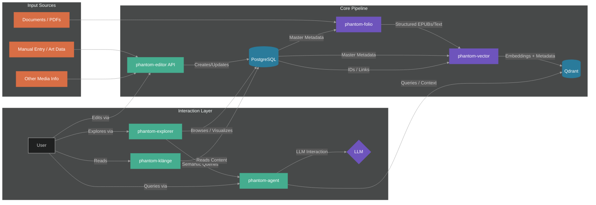

# Phantom


<div align="center">

*An integrated system for building a unified, queryable personal knowledge graph and semantic exploration engine.*

</div>

<br/>
<div align="center">───────  §  ───────</div>
<br/>


## Vision & Motivation

Phantom is an ambitious project designed to transform a massive personal library (books, articles, notes, images, media) into a cohesive, interconnected knowledge graph. It moves beyond simple file storage or isolated databases, aiming to create a "digital brain", a semantically rich, queryable representation of collected information.

This project stems from the desire to:

- **Catalog Deeply:** Go beyond basic metadata to capture complex relationships, thematic connections, and personal annotations across various media types.
- **Ingest Seamlessly:** Process and structure information from diverse sources, including challenging formats like scanned PDFs.
- **Explore Semantically:** Enable searching and discovery based on meaning and context, not just keywords.
- **Interact Naturally:** Facilitate querying and interaction using natural language.
- **Build a Foundation:** Create a robust, extensible platform for future analysis, visualization, and creative exploration.

<br/>
<div align="center">───────  §  ───────</div>
<br/>

## High-Level Architecture

The Phantom Suite employs a microservices-based architecture, where distinct components handle specific stages of the knowledge pipeline. Data flows from ingestion and structuring through semantic indexing to various interaction interfaces.



- **Core Data:** phantom-db acts as the central registry and relational store. phantom-vector (with Qdrant) provides the semantic index.
- **Ingestion:** phantom-folio handles document processing. phantom-editor allows structured data entry/modification.
- **Interaction:** phantom-agent enables LLM-based querying. phantom-explorer provides a visual interface. phantom-klänge powers external blog outputs.

<br/>
<div align="center">───────  §  ───────</div>
<br/>

## Phantom Projects Overview

The suite is composed of the following services, each residing in its own repository:
<br/>

| Project | Description | Technologies | Status |
|---------|-------------|--------------|--------|
| [**phantom-db**](https://github.com/Phantomklange/phantom-db) | PostgreSQL knowledge graph for complex art/media metadata. | PostgreSQL, SQLAlchemy, Alembic, Python | Active |
| [**phantom-folio**](https://github.com/Phantomklange/phantom-folio) | Document ingestion pipeline (PDF/OCR → EPUB) via Dockerized FastAPI/Celery. | FastAPI, Docker, Celery, PyTesseract, Python | Active |
| [**phantom-vector**](https://github.com/Phantomklange/phantom-vector) | Semantic indexing engine using Sentence Transformers & Qdrant vector DB. | PyTorch, Sentence Transformers, Qdrant, CUDA, Python | Active |
| [**phantom-editor**](https://github.com/Phantomklange/phantom-editor) | Web interface or API service for managing content within phantom-db. | FastAPI/Python, (Potential: React/Vue/HTMX) | Planned |
| [**phantom-agent**](https://github.com/Phantomklange/phantom-agent) | RAG-based LLM interface for natural language interaction with indexed content. | LangChain, LLMs, Transformers, Python | Planned |
| [**phantom-explorer**](https://github.com/Phantomklange/phantom-explorer) | Front-end application for browsing, exploring, and visualizing the knowledge suite. | React, TypeScript, D3.js, Tailwind CSS | Planned |
| [**phantom-klänge**](https://github.com/Phantomklange/phantom-klange) | Hugo theme framework for blogs powered by phantom-db data. | Hugo, Go Templates, HTML/CSS/JS, GitHub Actions | Active |

<br/>
<div align="center">───────  §  ───────</div>
<br/>

## This Repository (`Phantomklange/phantom`)

This repository serves as the **central entry point, documentation hub, and orchestration layer** for the entire Phantom Suite. It **does not contain the core source code** for the individual components listed above.

Its primary contents are:

- **Documentation:** This `README`, architectural details, design rationale (`docs/`).
- **Orchestration:** `docker-compose.yml` and related files (`*.env.example`) for setting up and running the entire suite locally.

<br/>
<div align="center">───────  §  ───────</div>
<br/>

## Getting Started (Local Development via Docker Compose)

These instructions outline how to run the core components of the Phantom Suite locally using Docker and Docker Compose.

**Prerequisites:**

*   Git
*   Docker Engine
*   Docker Compose
*   Sufficient RAM/Disk (See component requirements, especially for Qdrant/Embeddings)
*   (Optional but Recommended) NVIDIA GPU with NVIDIA Container Toolkit for `phantom-vector` acceleration.

**Steps:**

1.  **Clone Repositories:** Clone this `phantom` repository and all necessary component repositories (e.g., `phantom-db`, `phantom-folio`, `phantom-vector`) into a common parent directory structure expected by the `docker-compose.yml` file (modify paths in Compose file if needed).
    ```bash
    # Example Structure:
    # phantom-suite/
    # ├── phantom/ (This repo)
    # ├── phantom-db/
    # ├── phantom-folio/
    # └── phantom-vector/
    # ... etc

    git clone https://github.com/Phantomklange/phantom.git
    git clone https://github.com/Phantomklange/phantom-db.git
    # ... clone other required repos ...
    cd phantom # Navigate into this repository
    ```

2.  **Configure Environment:** Copy and populate the necessary `.env` files based on `.env.example` within this repository (for Compose) and potentially within individual component repos if they require specific build-time secrets not passed by Compose.
    ```bash
    cp .env.example .env
    # Edit .env with your database passwords, API keys, etc.
    ```

3.  **Build & Run Services:**
    ```bash
    docker-compose up --build -d
    ```
    *   This command will build the images for each service (using their respective Dockerfiles) and start the containers defined in `docker-compose.yml`.
    *   Use `docker-compose logs -f <service_name>` (e.g., `docker-compose logs -f phantom-folio-api`) to view logs.

4.  **Database Initialization:** You may need to run initial database migrations for `phantom-db` after the PostgreSQL container is up. This might involve exec'ing into the `phantom-db` container or running a command defined in the Compose file. (Refer to `phantom-db` README for specifics).
    ```bash
    # Example command (adjust based on actual setup):
    # docker-compose exec phantom-db alembic upgrade head
    ```

5.  **Access Services:** Refer to the `docker-compose.yml` file and individual component documentation to find the exposed ports and access points for APIs (e.g., `phantom-folio` API, `phantom-editor` UI) or databases (e.g., PostgreSQL, Qdrant UI).

**Stopping Services:**

```bash
docker-compose down
```

*(Detailed setup and usage for each component can be found in their respective repositories.)*

<br/>
<div align="center">───────  §  ───────</div>
<br/>

## Future Considerations & Roadmap

- Implementation of planned components (`phantom-editor`, `phantom-agent`, `phantom-explorer`).
- Expansion to other media types (images, music, film).
- Refinement of data models and relationships.
- Development of advanced querying and visualization features.
- Performance optimization and scaling strategies.
- Enhanced error handling and monitoring across services.

<br/>

---

*This project is actively under development.*
*Contact: [Pablo Aguirre](mailto:pablo.aguirre@phantomklange.com)*